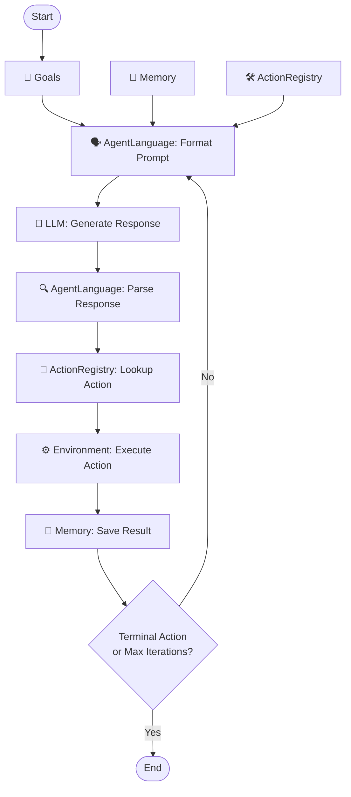

```mermaid
flowchart TD
    Start([Start])
    Goals[📌 Goals]
    Memory[🧠 Memory]
    Actions[🛠️ ActionRegistry]
    LangFormat[🗣️ AgentLanguage: Format Prompt]
    LLM[🤖 LLM: Generate Response]
    LangParse[🔍 AgentLanguage: Parse Response]
    ActionLookup[📇 ActionRegistry: Lookup Action]
    Execute[⚙️ Environment: Execute Action]
    Save[💾 Memory: Save Result]
    CheckEnd{Terminal Action<br>or Max Iterations?}
    End([End])

    Start --> Goals
    Goals --> LangFormat
    Memory --> LangFormat
    Actions --> LangFormat
    LangFormat --> LLM
    LLM --> LangParse
    LangParse --> ActionLookup
    ActionLookup --> Execute
    Execute --> Save
    Save --> CheckEnd
    CheckEnd -- No --> LangFormat
    CheckEnd -- Yes --> End
```