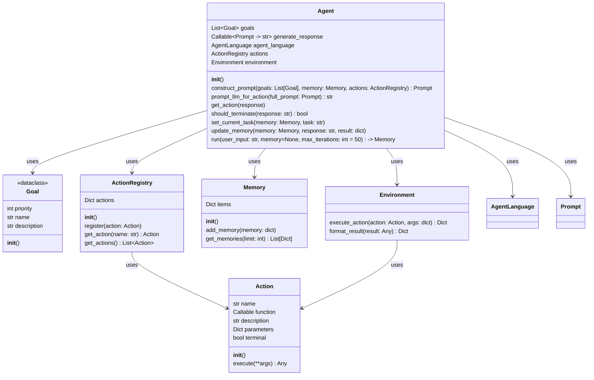

```mermaid
classDiagram
    class Goal {
        <<dataclass>>
        int priority
        str name
        str description

        __init__()
    }

    class Action {
        str name
        Callable function
        str description
        Dict parameters
        bool terminal

        __init__()
        execute(**args) Any
	}

	class ActionRegistry {
        Dict actions

        __init__()
        register(action: Action)
        get_action(name: str) Action
        get_actions() List~Action~
    }

    class Action

    ActionRegistry --> Action : uses

	class Memory {
		Dict items

		__init__()
		add_memory(memory: dict)
		get_memories(limit: int) List[Dict]
	}

	class Environment {
		execute_action(action: Action, args: dict) Dict
		format_result(result: Any) Dict
	}

    class Action

    Environment --> Action : uses

	class Agent {
        List~Goal~ goals
        Callable~Prompt -> str~ generate_response
        AgentLanguage agent_language
        ActionRegistry actions
        Environment environment

        __init__()
        construct_prompt(goals: List[Goal], memory: Memory, actions: ActionRegistry) Prompt
        prompt_llm_for_action(full_prompt: Prompt) str
        get_action(response)
        should_terminate(response: str) bool
        set_current_task(memory: Memory, task: str)
        update_memory(memory: Memory, response: str, result: dict)
        run(user_input: str, memory=None, max_iterations: int = 50) -> Memory
    }

    class ActionRegistry
    class AgentLanguage
    class Environment
    class Goal
    class Memory
    class Prompt

    Agent --> ActionRegistry : uses
    Agent --> AgentLanguage : uses
    Agent --> Environment : uses
    Agent --> Goal : uses
    Agent --> Memory : uses
    Agent --> Prompt : uses


```
