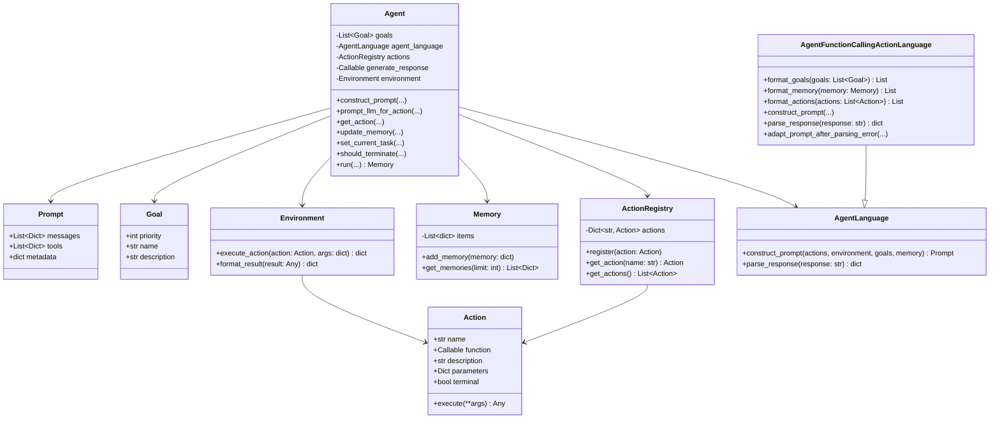

```mermaid
classDiagram

%% Классы данных
class Prompt {
  +List~Dict~ messages
  +List~Dict~ tools
  +dict metadata
}

class Goal {
  +int priority
  +str name
  +str description
}

%% Action-related
class Action {
  +str name
  +Callable function
  +str description
  +Dict parameters
  +bool terminal
  +execute(**args) Any
}

class ActionRegistry {
  -Dict~str, Action~ actions
  +register(action: Action)
  +get_action(name: str) Action
  +get_actions() List~Action~
}

ActionRegistry --> Action

%% Memory
class Memory {
  -List~dict~ items
  +add_memory(memory: dict)
  +get_memories(limit: int) List~Dict~
}

%% Environment
class Environment {
  +execute_action(action: Action, args: dict) dict
  +format_result(result: Any) dict
}

Environment --> Action

%% AgentLanguage и подклассы
class AgentLanguage {
  +construct_prompt(actions, environment, goals, memory) Prompt
  +parse_response(response: str) dict
}

class AgentFunctionCallingActionLanguage {
  +format_goals(goals: List~Goal~) List
  +format_memory(memory: Memory) List
  +format_actions(actions: List~Action~) List
  +construct_prompt(...)
  +parse_response(response: str) dict
  +adapt_prompt_after_parsing_error(...)
}

AgentFunctionCallingActionLanguage --|> AgentLanguage

%% Agent
class Agent {
  -List~Goal~ goals
  -AgentLanguage agent_language
  -ActionRegistry actions
  -Callable generate_response
  -Environment environment
  +construct_prompt(...)
  +prompt_llm_for_action(...)
  +get_action(...)
  +update_memory(...)
  +set_current_task(...)
  +should_terminate(...)
  +run(...) Memory
}

Agent --> Goal
Agent --> AgentLanguage
Agent --> ActionRegistry
Agent --> Environment
Agent --> Prompt
Agent --> Memory
```
